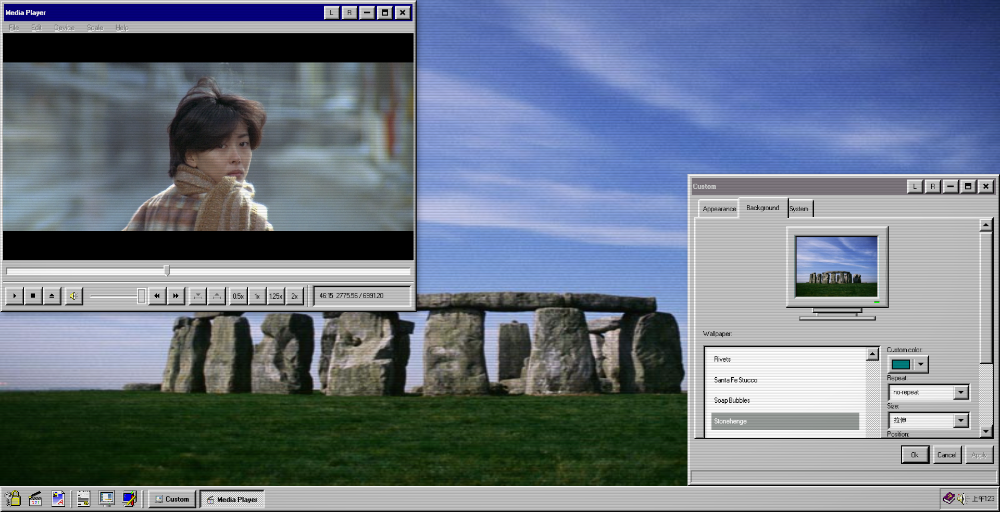

# vite-win-process

A Windows 95-style desktop simulation built with React, TypeScript, and Vite. Supports multi-window management, draggable/resizable windows, theme customization, media playback, PDF viewing, and a lock screen.



## Features

- **Multi-window process system** — open, minimize, restore, and close windows independently
- **Drag & resize** — windows are fully draggable and resizable via [interact.js](https://interactjs.io/)
- **Theme customization** — switch themes, change wallpapers, and adjust system colors in real time
- **Media Player** — video playback with seek, volume, and speed controls
- **PDF Reader** — in-window PDF viewer powered by [PDF.js](https://mozilla.github.io/pdf.js/)
- **Lock Screen** — password-protected lock screen overlay

## Tech Stack

|               |                                                                                 |
| ------------- | ------------------------------------------------------------------------------- |
| Framework     | React 18 + TypeScript + Vite                                                    |
| UI Library    | [react95](https://github.com/react95-io/React95) — Windows 95 component library |
| Styling       | styled-components                                                               |
| Drag & Resize | interact.js                                                                     |
| PDF Viewer    | PDF.js (static dist)                                                            |

## Inspiration

The visual style and interaction design are inspired by:

- **[win95-media-player](https://benwiley4000.github.io/win95-media-player)**
- **[Coins95](https://github.com/arturbien/Coins95)**

## Getting Started

```bash
pnpm install
pnpm dev
```

## Deploy To GitHub Pages

This repository is configured to publish the `dist` output to GitHub Pages at:

https://zixing8284.github.io/vite-win-process/
